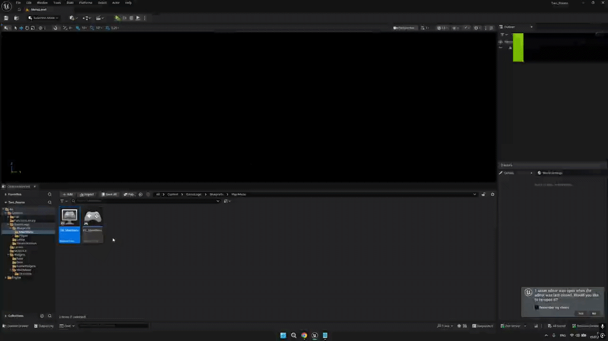
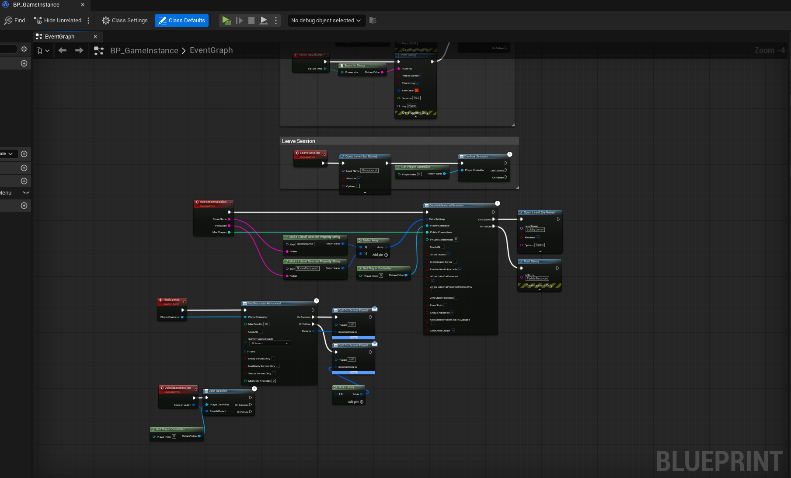
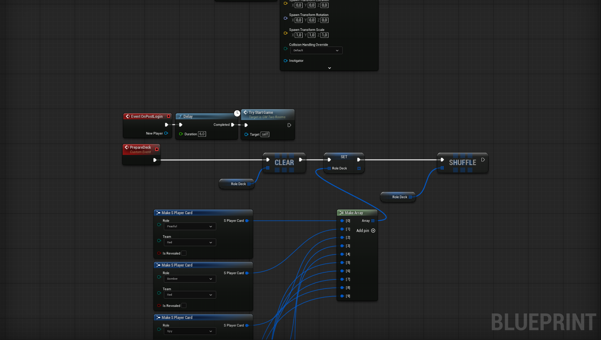
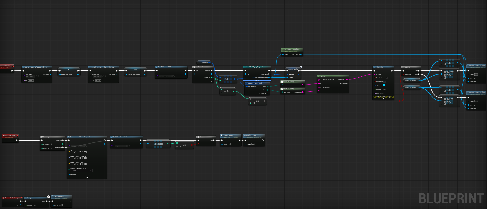
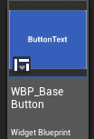
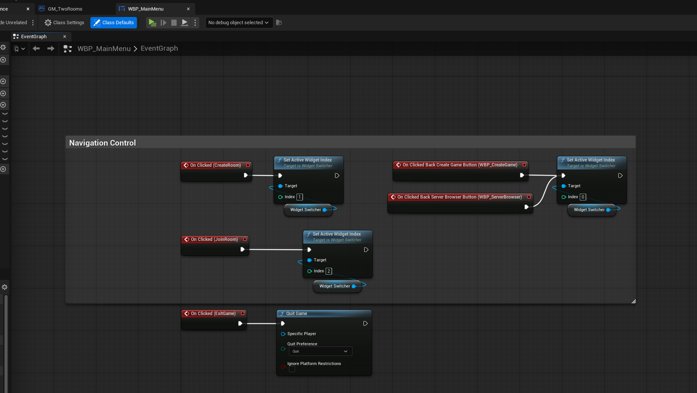

# "INDIE-GAME" - Technical Showcase

Welcome to the technical portfolio for **"ME_PROJECT"**. This repository serves as an open development log and code showcase, highlighting the core networking, UI architecture, and gameplay logic developed in **Unreal Engine 5**.

> **Note:** This repository contains a curated subset of the project. Its purpose is to demonstrate engineering standards, architectural patterns, and networking solutions, while keeping proprietary gameplay mechanics and assets private for commercial release.

---

## 🛠 Technical Overview
This project focuses on robust multiplayer architecture using Blueprint best practices.

### Core Systems Implemented:
* **Steamworks Integration:** Fully functional lobby system, session search, and room management.
* **Networking & Replication:** Advanced synchronization using `GameMode`, `GameState`, and `PlayerState`. Ensures client-server consistency for timers, game phases, and events.
* **Scalable UI Architecture:** Utilization of `WidgetSwitcher` for efficient navigation and modular `BaseWidget` classes (e.g., `WBP_BaseButton`) for maintainable front-end development.
* **Dynamic Gameplay Logic:** Procedural role distribution system and seamless lobby-to-game level transitions.

---

## 🎥 System Demonstration
*A brief walkthrough of the session management, password-protected joining, and lobby transition.*

---

## 🏗 Architectural Highlights

| Module | Description |
| :--- | :--- |
| **Networking** | `BP_GameInstance` handling Steam Session Subsystems. |
| **UI** | Optimized `WidgetSwitcher` for screen navigation. |
| **Logic** | Role shuffling and randomizer logic in `GM_TwoRooms`. |
| **Framework** | Modular usage of `GM`, `GS`, `PC`, and `PlayerState`. |

### Visual Documentation

  
  **Steam Session & Lobby Logic** 
  
  **Role Assignment & Spawning** 
  
  **Multiplayer Logic Flows** 
  
  **Modular UI Components** 
  
  **Navigation System** 

---

## 🚀 Key Features Breakdown

### 1. Multiplayer Networking
* **Session Management:** Implemented custom session creation with room naming and password protection.
* **Server Browser:** Dynamic list refreshing using Steam Subsystem.
* **Host-Client Sync:** Efficient use of `GameMode` and `GameState` to propagate game state changes to all clients, preventing desyncs.

### 2. UI Scalability
* **`WBP_BaseButton`:** Created a reusable base class for consistent UI styling and interaction handling.
* **`WidgetSwitcher`:** Implemented a clean, index-based navigation system to manage different menu states (Create Room, Join Room, etc.) efficiently.

### 3. Gameplay Logic
* **`BP_MyPlayerState`:** Centralized player data management for roles and team assignments.
* **`GM_TwoRooms`:** Orchestrates match flow, random role distribution, and spawning.

---
*This project is actively maintained. Feel free to explore the architectural approach and coding standards.*
